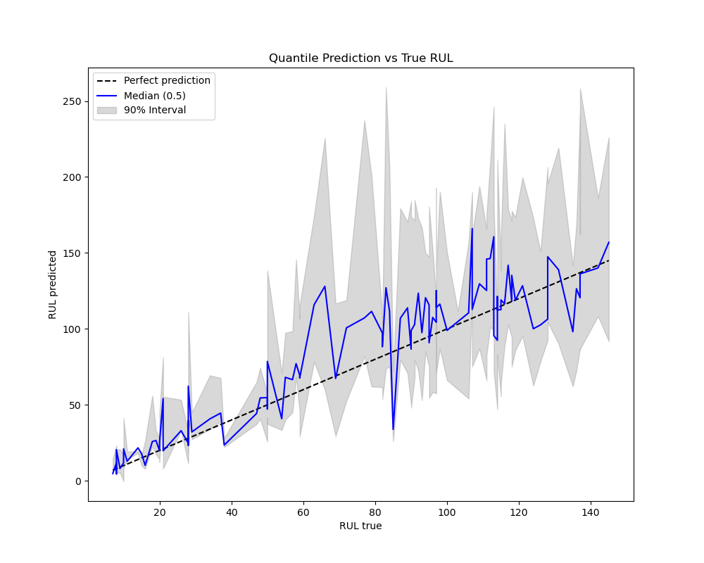

# NASA Turbofan Engine Remaining Useful Life (RUL) Prediction

## Project Summary
This project predicts the Remaining Useful Life (RUL) of turbofan engines using NASA's C-MAPSS dataset. Accurate RUL predictions enable predictive maintenance to reduce downtime and costs in aviation and manufacturing.

## Dataset
- NASA C-MAPSS dataset with multi-sensor time series data of engine degradation.
- Includes training and test sets with operational settings and sensor readings.

## Methodology
- Data cleaning and feature engineering to extract degradation patterns.
- Applied regression models: Random Forest, Gradient Boosting.
- Evaluated using RMSE and MAE metrics.

## Results
- Random Forest achieved RMSE of X and MAE of Y.
- Visualization of predicted vs actual RUL shown below.

## How to Run
1. Clone repo  
2. Create environment: `pip install -r requirements.txt`  
3. Run `notebooks/RUL_timeseries_XGBoost.ipynb` for detailed analysis and model training. You can run this via google colab.
4. There is also a modular framework, if you have enough computing power. Run python main.py to run locally without notebook interface
5. Finally there is a streamlit interface run streamlit run app.py

## Future Work
- Incorporate deep learning models (LSTM/GRU) for sequence modeling.
- Implement uncertainty quantification.

## Technologies
Python, pandas, scikit-learn, matplotlib, Jupyter Notebook

---

Feel free to reach out or check my portfolio: [suchitakulkarni.github.io](https://suchitakulkarni.github.io)

