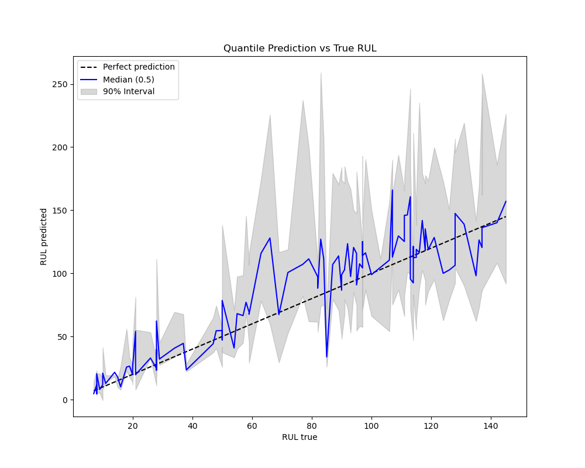

# NASA Turbofan Engine Remaining Useful Life (RUL) Prediction

Predicts the Remaining Useful Life (RUL) of turbofan engines using the NASA C-MAPSS dataset.
The project compares two approaches side by side to quantify the value of feature engineering:
a raw sensor baseline and a fully engineered pipeline, each trained in two modes (joint and separate).

## Dataset

NASA C-MAPSS (Commercial Modular Aero-Propulsion System Simulation) contains run-to-failure
time series for turbofan engines across four sub-datasets (FD001-FD004), varying in the number
of operating conditions and fault modes.

- FD001: 1 operating condition, 1 fault mode
- FD002: 6 operating conditions, 1 fault mode
- FD003: 1 operating condition, 2 fault modes
- FD004: 6 operating conditions, 2 fault modes

Each engine is described by 3 operational settings and 21 sensor readings per cycle.

## Methodology

### Feature pipelines

Two feature pipelines are implemented and compared:

**Raw pipeline**

- 14 sensor columns (7 sensors with near-zero variance dropped: s1, s5, s6, s10, s16, s18, s19)
- Raw cycle number (`time`)
- `dataset_id` appended in joint mode only

**Engineered pipeline**

- Same 14 sensors, condition-normalised via KMeans clustering on operational settings
  (6 clusters fitted on all training data)
- Rolling mean and rolling standard deviation per sensor per window size, giving
  14 sensors x number of windows x 2 statistics additional features
- `cycle_norm`: current cycle divided by the global max training cycle, normalised to [0, 1];
  a monotone decreasing constraint is enforced on this feature so that predicted RUL cannot
  rise as an engine ages
- `dataset_id` appended in joint mode only

### Training modes

| `--mode` | `--features` | Description |
|---|---|---|
| `joint` | `engineered` | one model trained on all four datasets with engineered features |
| `joint` | `raw` | one model trained on all four datasets with raw sensor values |
| `separate` | `engineered` | one model per dataset with engineered features |
| `separate` | `raw` | one model per dataset with raw sensor values |

### Model

XGBoost regressor with hyperparameters tuned via Optuna (minimising RMSE on a 20% stratified
holdout). Final model is re-trained on the full training set using the best found parameters.
RUL targets are capped at 125 cycles (piecewise-linear target).

## Results

### Engineered vs raw pipeline comparison (separate models, cap=125, windows=[5, 10, 20, 30])

| Dataset | Raw RMSE | Engineered RMSE |
|---|---|---|
| FD001 | _placeholder_ | _placeholder_ |
| FD002 | _placeholder_ | _placeholder_ |
| FD003 | _placeholder_ | _placeholder_ |
| FD004 | _placeholder_ | _placeholder_ |
| Overall | _placeholder_ | _placeholder_ |

### Predicted vs actual RUL

_Plots will be added after re-running evaluation scripts._

<!-- Replace with:  -->

## How to Run

```bash
# 1. Install dependencies
pip install -r requirements.txt
```

All hyperparameters and constants live in `configs/default.yaml`. The CLI flags
`--cap`, `--trials`, and `--window` override the config for quick experiments
without editing the file.

```bash
# 2. Train all four pipelines
python train.py --mode joint    --features engineered
python train.py --mode separate --features engineered
python train.py --mode joint    --features raw
python train.py --mode separate --features raw
```

Each run saves its model(s) to `results/models/` using the naming convention
`{mode}_{features}_{dataset}.pkl`, e.g. `separate_engineered_FD001.pkl`.
Preprocessing artifacts (`feature_engineer.pkl`, `condition_normaliser.pkl`)
are also saved there and reused by the evaluation script.

```bash
# 3. Evaluate combined performance of the separate models
python combined_pred.py --features engineered
python combined_pred.py --features raw
```

To override a config value from the command line:

```bash
python train.py --mode joint --features engineered --trials 50 --cap 100 --window 5 10
```

## Project Structure

```
.
+-- train.py               # training entry point (all four pipelines)
+-- combined_pred.py       # evaluation script for separate models
+-- configs/
|   +-- default.yaml       # all hyperparameters and constants
+-- src/
|   +-- config.py          # dataclasses that load and validate configs/default.yaml
|   +-- data.py            # data loading
|   +-- condition_normaliser.py  # KMeans-based operating condition normalisation
|   +-- feature_engineering.py  # rolling statistics and cycle normalisation
|   +-- rul_target.py      # piecewise-linear RUL target computation
|   +-- model.py           # XGBoost regressor with Optuna tuning
+-- results/
|   +-- models/            # saved models and preprocessing artifacts
+-- CMAPSSData/            # raw dataset (not tracked in git)
```

## Technologies

Python, pandas, NumPy, scikit-learn, XGBoost, Optuna, matplotlib

---

Portfolio: [suchitakulkarni.github.io](https://suchitakulkarni.github.io)
