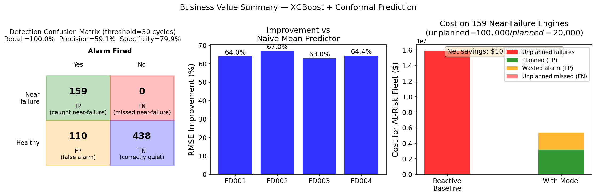
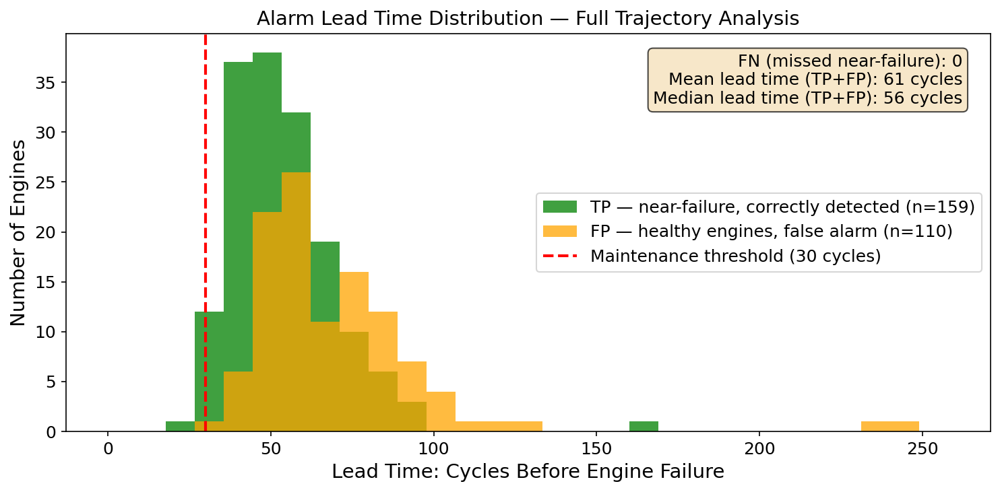
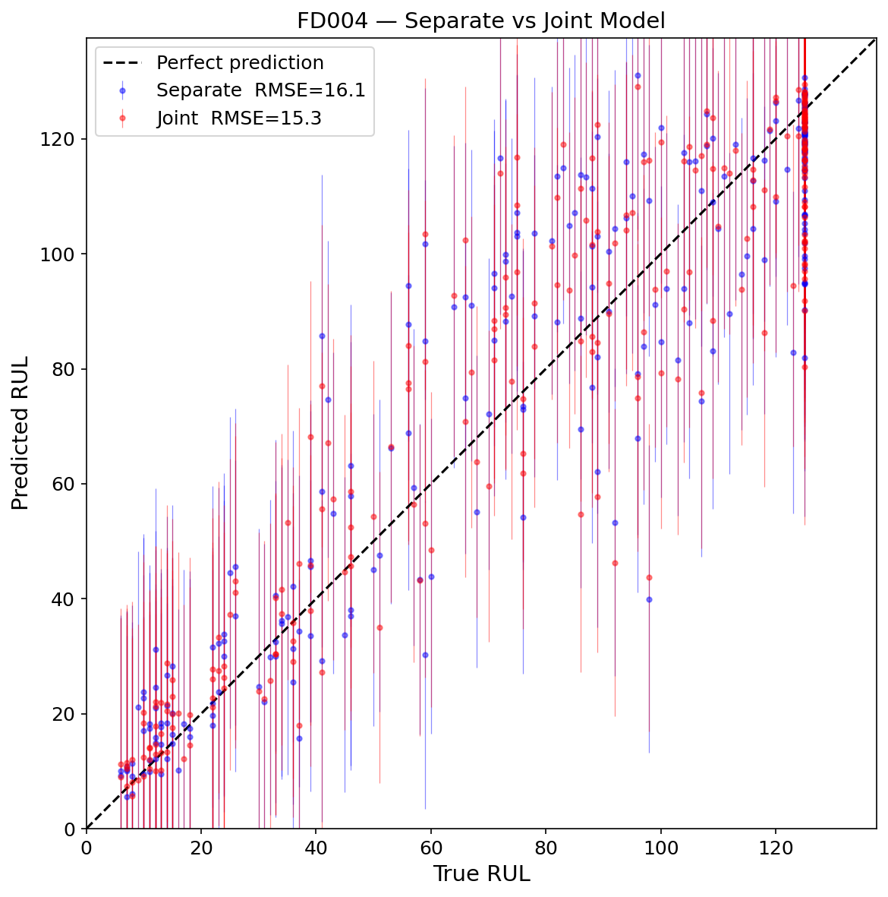
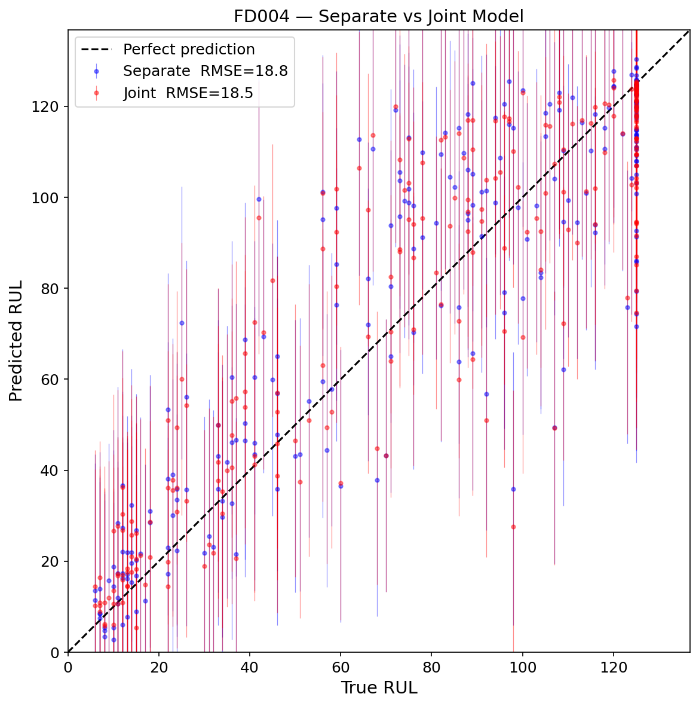

# NASA Turbofan Engine Remaining Useful Life (RUL) Prediction

Under the simulated maintenance policy described below, the engineered joint model reduces maintenance cost by more than 50% relative to reactive maintenance.
 



The methodology is explained below. 

Predicts the Remaining Useful Life (RUL) of turbofan engines using the NASA C-MAPSS dataset.
The project compares two approaches side by side to quantify the value of feature engineering:
a raw sensor baseline and a fully engineered pipeline, each trained in two modes (joint and separate).

## Dataset

NASA C-MAPSS (Commercial Modular Aero-Propulsion System Simulation) contains run-to-failure
time series for turbofan engines across four sub-datasets (FD001-FD004), varying in the number
of operating conditions and fault modes.

- FD001: 1 operating condition, 1 fault mode
- FD002: 6 operating conditions, 1 fault mode
- FD003: 1 operating condition, 2 fault modes
- FD004: 6 operating conditions, 2 fault modes

Each engine is described by 3 operational settings and 21 sensor readings per cycle.

## Methodology

<details>
<summary><strong>Feature pipelines</strong></summary>


Two feature pipelines are implemented and compared:

**Raw pipeline**

- 14 sensor columns (7 sensors with near-zero variance dropped: s1, s5, s6, s10, s16, s18, s19)
- Raw cycle number (`time`)
- `dataset_id` appended in joint mode only

**Engineered pipeline**

- Same 14 sensors, condition-normalised via KMeans clustering on operational settings
  (6 clusters fitted on all training data)
- Rolling mean and rolling standard deviation per sensor per window size, giving
  14 sensors × number of windows × 2 statistics additional features
- `cycle_norm`: current cycle divided by the global max training cycle, normalised to [0, 1];
  a monotone decreasing constraint is enforced on this feature so that predicted RUL cannot
  rise as an engine ages
- `dataset_id` appended in joint mode only


</details>

<details>
<summary><strong>Training modes</strong></summary>


| `--mode` | `--features` | Description |
|---|---|---|
| `joint` | `engineered` | one model trained on all four datasets with engineered features |
| `joint` | `raw` | one model trained on all four datasets with raw sensor values |
| `separate` | `engineered` | one model per dataset with engineered features |
| `separate` | `raw` | one model per dataset with raw sensor values |


</details>

<details>
<summary><strong>Model</strong></summary>


XGBoost regressor with hyperparameters tuned via Optuna (minimising RMSE on a 20% unit-stratified
holdout — split is done at the unit level so no unit's time steps appear in both train and val).
Final model is re-trained on the full training set using the best found parameters.
RUL targets are capped at 125 cycles (piecewise-linear target).


</details>

<details>
<summary><strong>Optuna optimisation</strong></summary>

The following hyperparameters were optimised by Optuna study

  
  | `Parameter`|`Range`|`Scale`|`What it controls`|
  |---|---|---|---|
  | `n_estimators`     | `[50, 500]`   | `linear` | `Number of trees`                         |
  | `max_depth`        | `[3, 10]`     | `linear` | `Max tree depth — complexity/overfitting` |
  | `learning_rate`    | `[0.01, 0.3]` | `log`    | `Shrinkage per tree`                      |
  | `subsample`        | `[0.5, 1.0]`  | `linear` | `Row fraction sampled per tree`           |
  | `colsample_bytree` | `[0.5, 1.0]`  | `linear` | `Feature fraction sampled per tree`       |
  | `reg_alpha`        | `[1e-6, 10]`  | `log`    | `L1 regularisation (sparsity)`            |
  | `reg_lambda`       | `[1e-6, 10]`  | `log`    | `L2 regularisation (weight shrinkage)`    |

Parameters not optimised
  - `early_stopping_rounds` (fixed at 50) — it terminates each trial's training early but is itself not searched
  - `loss_alpha` (0.7) — a design decision, not a hyperparameter
  - `Window sizes` [5, 10, 20, 30] — fixed before training, baked into the features
  - `n_clusters` (6) — domain knowledge, not tuned
  - `Monotone` constraint on `cycle_norm` — structural, always on


</details>

<details>
<summary><strong>Uncertainty quantification</strong></summary>


Conformal prediction intervals (90% nominal coverage) are calibrated using split conformal
with cluster-stratified nonconformity quantiles. Calibration units are held out from the
temporary model used to compute nonconformity scores, ensuring valid marginal coverage
guarantees on unseen test units.


</details>

### Business cost model

The model is evaluated against a reactive baseline (wait-for-failure, no predictive system).
An alarm fires when the predicted RUL drops below a **30-cycle lead-time threshold**.
Each engine in the test set is classified into one of four outcomes:

| Outcome | Description | Cost |
|---|---|---|
| TP — correct alarm | Near-failure engine correctly flagged | $20,000 (planned maintenance) |
| FP — false alarm | Healthy engine unnecessarily flagged | $20,000 (wasted planned maintenance) |
| FN — missed failure | Near-failure engine not flagged | $100,000 (unplanned failure) |
| TN — correctly quiet | Healthy engine, no alarm | $0 |

**Baseline**: every near-failure engine fails unplanned → each costs $100,000.

**Net savings** = TP × ($100,000 − $20,000) − FP × $20,000

The 5× cost ratio between unplanned and planned maintenance reflects industry benchmarks
for turbofan overhaul (unplanned AOG events include airframe downtime, expedited parts, and
labour premiums on top of the repair itself). The threshold and cost figures are configurable
via `--lead-time`, `--cost-unplanned`, and `--cost-planned` CLI flags.

## Results

### Engineered vs raw pipeline comparison (separate models, cap=125, windows=[5, 10, 20, 30])

| Dataset | Individual Model |          | Combined Model |          |
|-------|-----------|----------|------------|----------|
|   |Raw features | Engineered features | Raw features | engineered features |
| FD001 | 17.34      | 15.69      | 15.95       | 14.41     |
| FD002 | 16.24      | 14.96      | 15.94       | 14.17     |
| FD003 | 19.84      | 15.36      | 19.13       | 14.48     |
| FD004 | 18.77      | 16.09      | 18.50       | 15.30     |


### Predicted vs actual RUL


<table>
  <tr>
    <td align="center">
      <br>
      Results using engineered features 
    </td>
    <td align="center">
      <br>
      Results using raw features
    </td>
  </tr>
</table>

The results at the top were derived using feature engineering, trained on combination of all four datasets. 

## How to Run

<details>
<summary><strong>Installation</strong></summary>

```bash
# 1. Install dependencies
pip install -r requirements.txt
```

All hyperparameters and constants live in `configs/default.yaml`. The CLI flags
`--cap`, `--trials`, and `--window` override the config for quick experiments
without editing the file.
</details>

<details>
<summary><strong>Joint model pipeline (recommended)</strong></summary>

```bash
# 2. Train — one model on all four datasets
python train.py --mode joint --features engineered
python train.py --mode joint --features raw

# 3. Calibrate conformal prediction intervals
python calibrate.py --features engineered
python calibrate.py --features raw

# 4. Final evaluation and plots
python run_evaluation.py --features engineered
python run_evaluation.py --features raw
```
</details>

<details>
<summary><strong>Separate model pipeline</strong></summary>

```bash
# 2. Train — one model per dataset
python train.py --mode separate --features engineered
python train.py --mode separate --features raw

# 3. Evaluate combined performance across all four datasets
python combined_pred.py --features engineered
python combined_pred.py --features raw
```
</details>

<details>
<summary><strong>Artifact naming</strong></summary>

Every run saves its artifacts under `results/models/` using an `artifact_tag` that defaults
to `{mode}_{features}` (e.g. `joint_engineered`). The full naming scheme:

| File | Example |
|---|---|
| Model | `joint_engineered_model.pkl` |
| Feature engineer | `feature_engineer_joint_engineered.pkl` |
| Condition normaliser | `condition_normaliser_joint_engineered.pkl` |
| Conformal predictor | `conformal_predictor_joint_engineered.pkl` |
| Separate model | `separate_engineered_FD001.pkl` |
</details>

<details>
<summary><strong>Running experiments in parallel</strong></summary>

Use `--run-tag` to namespace artifacts and `--n-jobs 1` to avoid CPU oversubscription:

```bash
# Two experiments side by side, each with their own artifact set
python train.py --mode joint --features engineered --window 5 10    --run-tag exp_w10  --n-jobs 1 &
python train.py --mode joint --features engineered --window 5 10 20 --run-tag exp_w20  --n-jobs 1 &
wait

# Calibrate and evaluate each experiment independently
python calibrate.py      --features engineered --run-tag exp_w10
python run_evaluation.py --features engineered --run-tag exp_w10

python calibrate.py      --features engineered --run-tag exp_w20
python run_evaluation.py --features engineered --run-tag exp_w20
```
</details>

<details>
<summary><strong>Overriding config values from the command line</strong></summary>

```bash
python train.py --mode joint --features engineered --trials 50 --cap 100 --window 5 10
```
</details>

## Project Structure

```
.
├── train.py               # training entry point (all four pipelines)
├── calibrate.py           # conformal calibration for a joint model
├── run_evaluation.py      # final metrics, RUL trajectory plots, feature importance
├── combined_pred.py       # evaluation script for separate models (with optional conformal uncertainty)
├── main.py                # legacy quantile-XGBoost pipeline (FD001–FD004 individually)
├── configs/
│   └── default.yaml       # all hyperparameters and constants
├── src/
│   ├── config.py          # dataclasses that load and validate configs/default.yaml
│   ├── data.py            # data loading and StandardScaler normalisation (legacy pipeline)
│   ├── condition_normaliser.py  # KMeans-based operating condition normalisation
│   ├── feature_engineering.py  # rolling statistics and cycle normalisation
│   ├── rul_target.py      # piecewise-linear RUL target computation
│   ├── model.py           # XGBoost regressor with Optuna tuning (RULModel)
│   ├── conformal.py       # split-conformal predictor with cluster-stratified quantiles
│   ├── evaluation.py      # RMSE, MAE, CMAPSS score, cost savings
│   ├── evaluate.py        # CSV writing and quantile-pipeline plot (legacy)
│   └── visualisation.py   # all matplotlib plots
├── results/
│   ├── models/            # saved models and preprocessing artifacts
│   └── evaluation/        # metrics CSV, RUL plots, coverage plots
└── CMAPSSData/            # raw dataset (not tracked in git)
```

## Technologies

Python, pandas, NumPy, scikit-learn, XGBoost, Optuna, matplotlib

---

Portfolio: [suchitakulkarni.github.io](https://suchitakulkarni.github.io)
